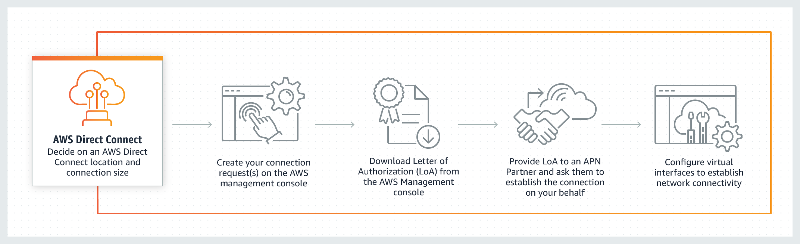
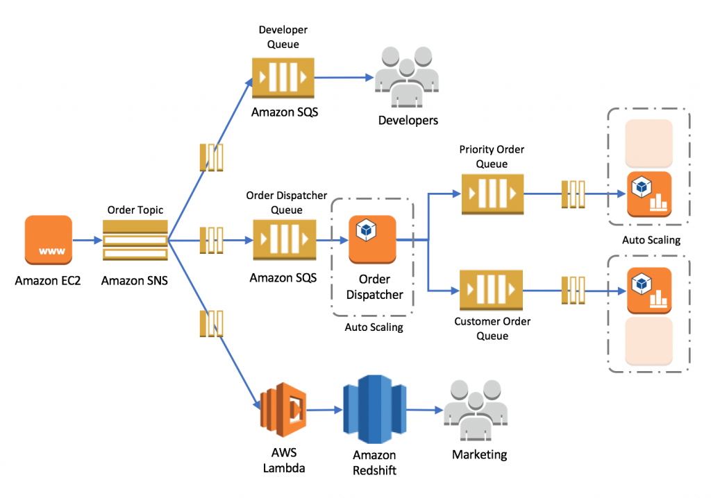

# Repaso Certificacion AWS Practitioner

## Conceptos Cloud

### AWS CloudTrail

Puedes utilizar CloudTrail para registrar, monitorizar y conservar la actividad de la cuenta relacionada con acciones en toda tu infraestructura de AWS. CloudTrail proporciona un historial de eventos de la actividad de tu cuenta de AWS, incluidas las acciones realizadas a través de la consola de administración de AWS, los SDK de AWS, las herramientas de línea de comandos y otros servicios de AWS.

Cómo funciona CloudTrail:

### AWS Config

AWS Config es un servicio que te permite evaluar, auditar y valorar las configuraciones de tus recursos de AWS. Config monitoriza y registra continuamente las configuraciones de tus recursos de AWS y te permite automatizar la evaluación de las configuraciones registradas comparándolas con las configuraciones deseadas.

### Amazon CloudWatch

Amazon CloudWatch es un servicio de monitorización y observabilidad creado para ingenieros DevOps, desarrolladores, ingenieros de fiabilidad de sitios (SRE) y administradores de TI. CloudWatch proporciona datos y perspectivas procesables para monitorizar aplicaciones, responder a cambios de rendimiento en todo el sistema, optimizar la utilización de recursos y obtener una visión unificada de la salud operativa. Es un servicio excelente para construir sistemas resistentes.

### AWS Trusted Advisor

AWS Trusted Advisor es una herramienta online que te proporciona orientación en tiempo real para ayudarte a aprovisionar tus recursos siguiendo las mejores prácticas de AWS sobre optimización de costes, seguridad, tolerancia a fallos, límites de servicio y mejora del rendimiento.

### CloudWatch vs CloudTrail vs Config

Piensa en supervisión del rendimiento de los recursos, eventos y alertas; piensa en CloudWatch.

Piensa en actividad y auditoría específicas de la cuenta; piensa en CloudTrail.

Piensa en el historial de cambios, la auditoría y el cumplimiento de recursos específicos; piensa en Config.

### Amazon Relational Database Service (Amazon RDS)

Facilita la configuración, el funcionamiento y el escalado de una base de datos relacional en el Cloud. Proporciona una capacidad rentable y redimensionable, al tiempo que automatiza tareas de administración que llevan mucho tiempo, como el aprovisionamiento de hardware, la configuración de la base de datos, la aplicación de parches y las copias de seguridad.

Amazon RDS proporciona una selección de tipos de instancia optimizados para adaptarse a diferentes casos de uso de bases de datos relacionales. Los tipos de instancia comprenden distintas combinaciones de CPU, memoria, almacenamiento y capacidad de red, y te ofrecen la flexibilidad de elegir la combinación adecuada de recursos para tu base de datos, a fin de optimizarla para tu caso de uso seleccionando el tipo y tamaño de instancia correctos.

Como las instancias RDS están optimizadas para la memoria, el rendimiento o la E/S, por lo tanto, el rendimiento de la instancia de Amazon Relational Database Service (Amazon RDS) administrada por AWS es mejor que el de una instancia de base de datos administrada por el cliente.

### 6 Ventajas de servicios en la nube

### Cloud caracteristicas

**Agilidad**
En el mundo de la computación en el Cloud, "Agilidad" se refiere a la capacidad de desarrollar, probar y lanzar rápidamente aplicaciones de software que impulsen el crecimiento empresarial Otra forma de explicar la "Agilidad": AWS proporciona una infraestructura global masiva en el Cloud que te permite innovar, experimentar e iterar rápidamente. En lugar de esperar semanas o meses por el hardware, puedes desplegar instantáneamente nuevas aplicaciones. Esta capacidad se llama agilidad.

**Elasticidad**
Esto se refiere a la capacidad de adquirir recursos según los necesites y liberarlos cuando ya no sean necesarios, se denomina Elasticidad del Cloud.

**Fiabilidad**
Se refiere a la capacidad de un sistema para recuperarse de las interrupciones de la infraestructura o de los servicios, mediante la adquisición dinámica de recursos informáticos para satisfacer la demanda y mitigar las interrupciones.

**Escalabilidad**
La escalabilidad es la medida de la capacidad de un sistema de crecer para adaptarse a un aumento de la demanda, o reducirse ante una demanda decreciente.

### Grupo de seguridad

Visión general del grupo de seguridad:

### lista de control de acceso a la red (NACL)

Visión general de la lista de control de acceso a la red (NACL):

### AWS Basic Support

El plan AWS Basic Support sólo proporciona acceso a lo siguiente:

Servicio de atención al cliente y comunidades - Acceso 24x7 al servicio de atención al cliente, documentación, Whitepapers y foros de soporte. AWS Trusted Advisor - Acceso a las comprobaciones básicas de Trusted Advisor y orientación para aprovisionar tus recursos siguiendo las mejores prácticas para aumentar el rendimiento y mejorar la seguridad. Salud de AWS - El panel de salud de tu cuenta : Una vista personalizada de la salud de tus servicios AWS, y alertas cuando tus recursos se vean afectados.

### AWS Developer Support

Deberías utilizar el plan AWS Developer Support si estás probando o realizando desarrollos iniciales en AWS y deseas tener la posibilidad de obtener soporte técnico por correo electrónico durante el horario laboral, así como orientación general sobre arquitectura a medida que construyes y pruebas. Este plan proporciona acceso sólo a las comprobaciones básicas de Trusted Advisor de la Cuota de Servicio y a las comprobaciones básicas de Seguridad.

### AWS Enterprise Support

El plan AWS Enterprise Support proporciona a los clientes un servicio similar al de un conserje, en el que el objetivo principal es ayudar al cliente a conseguir sus resultados y encontrar el éxito en el Cloud. Con AWS Enterprise Support, obtienes soporte técnico 24x7 de ingenieros de alta calidad, herramientas y tecnología para administrar automáticamente el estado de tu entorno, orientación arquitectónica consultiva y un administrador técnico de cuentas (TAM) designado para coordinar el acceso a programas proactivos/preventivos y a expertos en la materia de AWS. También obtienes acceso completo a las comprobaciones de buenas prácticas de AWS Trusted Advisor.

### AWS Business Support

Deberías utilizar el plan AWS Business Support si tienes cargas de trabajo de producción en AWS y quieres acceso telefónico, por correo electrónico y por chat 24x7 a soporte técnico y orientación sobre arquitectura en el contexto de tus casos de uso específicos. También obtienes acceso completo a las comprobaciones de buenas prácticas de AWS Trusted Advisor.

### AWS Enterprise On-Ramp Support

Deberías utilizar el plan AWS Enterprise On-Ramp Support si tienes cargas de trabajo de producción/negocio críticas en AWS y quieres acceso 24x7 a soporte técnico y necesitas orientación experta para crecer y optimizar en el Cloud. Obtendrás acceso completo a las comprobaciones de buenas prácticas de AWS Trusted Advisor.

### Socio consultor de APN

La red de socios de AWS (APN) es el programa global de socios para empresas de tecnología y consultoría que aprovechan Amazon Web Services (AWS) para crear soluciones y servicios para los clientes.

Los socios consultores de APN son empresas de servicios profesionales que ayudan a clientes de todo tipo y tamaño a diseñar, arquitecturar, construir, migrar y administrar sus cargas de trabajo y aplicaciones en AWS, acelerando su migración al Cloud de AWS.

### Socio tecnológico de APN

Los socios tecnológicos de APN proporcionan hardware, servicios de conectividad o soluciones de software que se alojan en el Cloud de AWS o se integran con ella. Los socios tecnológicos de APN no pueden ayudar a migrar a AWS ni a administrar aplicaciones en el Cloud de AWS.

### AWS Direct Connect

AWS Direct Connect es una solución de servicio en el Cloud que facilita el establecimiento de una conexión de red dedicada desde tus instalaciones a AWS. Puedes utilizar AWS Direct Connect para establecer una interfaz virtual privada desde tu red local directamente a tu Amazon VPC, proporcionándote una conexión de red privada de gran ancho de banda entre tu red y tu VPC. Esta conexión es privada y no va por el Internet público. Se tarda al menos un mes en establecer esta conexión física.

Cómo funciona AWS Direct Connect:

### Amazon VPC Endpoint

Amazon VPC Endpoint te permite conectar de forma privada tu VPC a los servicios de AWS compatibles y a los servicios de punto final de VPC impulsados por AWS PrivateLink sin necesidad de una puerta de enlace a Internet, un dispositivo NAT, una conexión VPN o una conexión AWS Direct Connect. Las instancias de tu VPC no necesitan direcciones IP públicas para comunicarse con los recursos del servicio. El tráfico entre tu VPC y el otro servicio no sale de la red de Amazon. VPC Endpoint no puede utilizarse para conectar de forma privada el centro de datos local al Cloud de AWS.

### Internet Gateway (Puerta de enlace de internet)

Internet Gateway es un componente de la VPC de escala horizontal, redundante y de alta disponibilidad que permite la comunicación entre tu VPC e Internet. Una puerta de enlace a Internet tiene dos finalidades: proporcionar un destino en las tablas de rutas de tu VPC para el tráfico enrutable por Internet y realizar la traducción de direcciones de red (NAT) para las instancias. La puerta de enlace a Internet no puede utilizarse para conectar de forma privada el centro de datos local al Cloud de AWS.

### VPN Site-to-Site

VPN Site-to-Site crea una conexión segura entre tu centro de datos o sucursal y tus recursos en el Cloud de AWS. Esta conexión va a través del Internet público.

## Tecnologia

### Amazon Simple Queue Service (SQS)

Amazon Simple Queue Service (SQS) es un servicio de cola de mensajes totalmente administrado que te permite desacoplar y escalar microservicios, sistemas distribuidos y aplicaciones sin servidor. Utilizando SQS, puedes enviar, almacenar y recibir mensajes entre componentes de software a cualquier volumen, sin perder mensajes ni requerir que otros servicios estén disponibles.

### Amazon Simple Notification Service (SNS)

Amazon Simple Notification Service (SNS) es un servicio de mensajería pub/sub de alta disponibilidad, duradero, seguro y totalmente administrado que te permite desacoplar microservicios, sistemas distribuidos y aplicaciones sin servidor. Utilizando los temas de Amazon SNS, tus sistemas publicadores pueden enviar mensajes a un gran número de puntos finales suscriptores para procesarlos en paralelo, incluidas las colas de Amazon SQS, las funciones de AWS Lambda y los webhooks HTTP/S. Además, SNS puede utilizarse para distribuir notificaciones a los usuarios finales mediante push móvil, SMS y correo electrónico.

### Arquitectura SNS SQS

### Amazon Elastic Compute Cloud (Amazon EC2)

Amazon Elastic Compute Cloud (Amazon EC2) es un servicio web que proporciona capacidad informática segura y redimensionable en el Cloud con soporte para facturación por segundos. Es la forma más sencilla de aprovisionar servidores en el Cloud de AWS y acceder al SO subyacente. EC2 no puede utilizarse para desacoplar componentes de una aplicación basada en microservicios.

### AWS Lambda

AWS Lambda te permite ejecutar código sin aprovisionar ni administrar servidores. Sólo pagas por el tiempo de cómputo que consumes. Lambda no puede utilizarse para desacoplar componentes de una aplicación basada en microservicios.

### AWS Step Functions

AWS Step Functions te permite coordinar varios servicios de AWS en flujos de trabajo sin servidor. Puedes diseñar y ejecutar flujos de trabajo que unan servicios como AWS Lambda, AWS Glue y Amazon SageMaker. AWS Step Functions no puede utilizarse para desacoplar componentes de una aplicación basada en microservicios.

### Amazon DynamoDB

Amazon DynamoDB es una base de datos NoSQL de valores clave, sin servidor y totalmente administrada, diseñada para ejecutar aplicaciones de alto rendimiento a cualquier escala. DynamoDB ofrece seguridad integrada, copias de seguridad continuas, replicación multirregión automatizada, almacenamiento en caché en memoria y herramientas de exportación de datos.

Las tablas globales de DynamoDB replican los datos automáticamente en las regiones de AWS que elijas y escalan automáticamente la capacidad para adaptarse a tus cargas de trabajo. Con las tablas globales, tus aplicaciones distribuidas globalmente pueden acceder a los datos localmente en las regiones seleccionadas para obtener un rendimiento de lectura y escritura de milisegundos de un solo dígito. DynamoDB ofrece el soporte activo-activo entre regiones que necesita la empresa.

### Amazon DynamoDB con DynamoDB Accelerator

DynamoDB Accelerator(DAX) es una caché en memoria que proporciona un rendimiento de lectura rápido para tus tablas a escala, permitiéndote utilizar una caché en memoria totalmente gestionada. Con DAX, puedes mejorar el rendimiento de lectura de tus tablas DynamoDB hasta 10 veces, haciendo que el tiempo necesario para las lecturas pase de milisegundos a microsegundos, incluso con millones de solicitudes por segundo. DAX no ofrece configuración activa-activa entre Regiones.

### Amazon Aurora

Amazon Aurora (Aurora) es un motor de base de datos relacional totalmente gestionado que es compatible con MySQL y PostgreSQL. Con algunas cargas de trabajo, Aurora puede ofrecer hasta cinco veces el rendimiento de MySQL y hasta tres veces el rendimiento de PostgreSQL sin necesidad de realizar cambios en la mayoría de tus aplicaciones actuales. En un Cluster multimaestro, todas las instancias de la BD tienen capacidad de lectura/escritura. Aurora no es una base de datos NoSQL, por lo que esta opción es incorrecta.

Amazon Aurora es una base de datos relacional compatible con MySQL y PostgreSQL creada paral Cloud. Amazon Aurora está totalmente administrado por Amazon Relational Database Service (RDS), que automatiza las tareas de administración que llevan mucho tiempo, como el aprovisionamiento de hardware, la configuración de la base de datos, la aplicación de parches y las copias de seguridad. El equipo de productos de AWS se encarga de aplicar parches al sistema operativo subyacente de AWS Aurora.

### Amazon Relational Database Service(Amazon RDS)

Amazon Relational Database Service (Amazon RDS) facilita la configuración, el funcionamiento y el escalado de una base de datos relacional en el Cloud. Proporciona una capacidad rentable y redimensionable, a la vez que automatiza tareas de administración que consumen mucho tiempo, como el aprovisionamiento de hardware, la configuración de la base de datos, la aplicación de parches y las copias de seguridad. Te libera para que puedas centrarte en tus aplicaciones y darles el rendimiento rápido, la alta disponibilidad, la seguridad y la compatibilidad que necesitan.

### Amazon Simple Storage Service (Amazon S3)

Amazon Simple Storage Service (Amazon S3) es un servicio de almacenamiento de objetos que ofrece escalabilidad, disponibilidad de datos, seguridad y rendimiento líderes en el sector.

### Amazon Elastic File System (Amazon EFS)

Amazon Elastic File System (Amazon EFS) proporciona un sistema de archivos NFS elástico, sencillo, escalable y totalmente administrado para su uso con los servicios en el Cloud de AWS y los recursos locales. Está diseñado para escalar bajo demanda a petabytes sin interrumpir las aplicaciones, creciendo y reduciéndose automáticamente a medida que añades y eliminas archivos, eliminando la necesidad de aprovisionar y administrar la capacidad para acomodar el crecimiento.

### S3 Standard-Infrequent Access (S3 Standard-IA)

Amazon S3 Standard-Infrequent Access (S3 Standard-IA) es para datos a los que se accede con menos frecuencia, pero que requieren un acceso rápido cuando se necesitan. S3 Standard-Infrequent Access (S3 Standard-IA) ofrece la alta durabilidad, el alto rendimiento y la baja latencia de S3 Standard, con un bajo precio por GB de almacenamiento y por GB de recuperación. Esta combinación de bajo coste y alto rendimiento hace que S3 Standard-Infrequent Access (S3 Standard-IA) sea ideal para almacenamiento a largo plazo, copias de seguridad y como almacén de datos para archivos de recuperación ante desastres.

### Amazon S3 Standard

El S3 Standard de Amazon ofrece almacenamiento de objetos de alta durabilidad, disponibilidad y rendimiento para datos a los que se accede con frecuencia.

### Amazon S3 Intelligent-Tiering (S3 Inteligente)

La clase de almacenamiento Amazon S3 Intelligent-Tiering está diseñada para optimizar los costes moviendo automáticamente los datos al nivel de acceso más rentable, sin impacto en el rendimiento ni sobrecarga operativa. Funciona almacenando objetos en dos niveles de acceso: un nivel optimizado para el acceso frecuente y otro nivel de menor coste optimizado para el acceso infrecuente.

### Amazon S3 Glacier

Amazon S3 Glacier es una clase de almacenamiento en el Cloud de Amazon S3 segura, duradera y de coste extremadamente bajo para archivar datos y realizar copias de seguridad a largo plazo. Está diseñado para ofrecer una durabilidad del 99,999999999% y proporcionar capacidades integrales de seguridad y normativa que pueden ayudar a cumplir incluso los requisitos normativos más estrictos. S3 Glacier no admite la recuperación rápida de datos.

### Amazon S3 Glacier Deep Archive

Amazon S3 Glacier Deep Archive es la clase de almacenamiento de menor coste de Amazon S3 y soporta la retención a largo plazo y la preservación digital de datos a los que se puede acceder una o dos veces al año. Está diseñado para clientes -especialmente los de sectores muy regulados, como los servicios financieros, la sanidad y el sector público- que conservan conjuntos de datos durante 7-10 años o más para cumplir los requisitos normativos. S3 Glacier Deep Archive también puede utilizarse para casos de uso de backup y recuperación de desastres. Tiene un tiempo de recuperación (latencia del primer byte) de 12 a 48 horas.

### Amazon EMR

Amazon EMR es la plataforma de big data en el Cloud líder del sector para procesar grandes cantidades de datos utilizando herramientas de código abierto como Hadoop, Apache Spark, Apache Hive, Apache HBase, Apache Flink, Apache Hudi y Presto. Amazon EMR puede utilizarse para aprovisionar recursos para ejecutar cargas de trabajo de big data en clústeres Hadoop. Amazon EMR aprovisiona instancias EC2 para administrar su carga de trabajo. Amazon EMR no es un servicio sin servidor.

### AWS Elastic Beanstalk

AWS Elastic Beanstalk es un servicio fácil de usar para implementar y escalar aplicaciones y servicios web. Sólo tienes que subir tu código y Elastic Beanstalk se encarga automáticamente del despliegue, desde el aprovisionamiento de capacidad, el equilibrio de carga y el autoescalado hasta la monitorización del estado de la aplicación. AWS Elastic Beanstalk aprovisiona servidores, por lo que no es un servicio sin servidor.

### Amazon Transcribe

Puedes utilizar Amazon Transcribe para añadir capacidad de conversión de habla a texto a tus aplicaciones. Amazon Transcribe utiliza un proceso de Deep Learning llamado reconocimiento automático del habla (ASR) para convertir el habla en texto con rapidez y precisión. Amazon Transcribe puede utilizarse para transcribir llamadas de atención al cliente, automatizar subtítulos y subtitulado, y generar metadatos para activos multimedia.

Casos prácticos de Amazon Transcribe:

### Amazon Polly

Puedes utilizar Amazon Polly para convertir texto en habla realista, lo que te permitirá crear aplicaciones que hablen. El servicio de conversión de texto en habla (TTS) de Polly utiliza tecnologías avanzadas de Deep Learning para sintetizar el habla humana con un sonido natural.

Beneficios de Amazon Polly:

### AWS X-Ray

Puedes utilizar AWS X-Ray para analizar y depurar aplicaciones distribuidas y sin servidor, como las creadas con una arquitectura de microservicios. Con X-Ray, puedes comprender el rendimiento de tu aplicación y sus servicios subyacentes para identificar y solucionar la causa raíz de los problemas y errores de rendimiento.

Cómo funciona AWS X-Ray:

### Host dedicado

Los hosts dedicados de Amazon EC2 te permiten utilizar tus licencias de software elegibles de proveedores como Microsoft y Oracle en Amazon EC2. Un host dedicado de Amazon EC2 es un servidor físico totalmente dedicado para tu uso, por lo que puedes ayudar a cumplir los requisitos corporativos.

### Instancia dedicada

Una instancia dedicada es una instancia de Amazon EC2 que se ejecuta en Virtual Private Cloud (VPC) en hardware dedicado a un solo cliente. Las instancias Dedicadas que pertenecen a diferentes cuentas de AWS están físicamente aisladas a nivel de hardware. Sin embargo, las instancias Dedicadas pueden compartir hardware con otras instancias de la misma cuenta de AWS que no sean instancias Dedicadas. No puedes utilizar instancias Dedicadas para utilizar licencias de software vinculadas al servidor.

### Instancia reservada (RI)

Una instancia reservada te proporciona un ahorro significativo (hasta el 75%) en tus costes de Amazon EC2 en comparación con los precios de las instancias bajo demanda. Una istancia reservada no es una instancia física, sino un descuento de facturación aplicado al uso de una instancia bajo demanda en tu cuenta. Puedes adquirir una instancia reservada (RI) para un compromiso de uno o tres años, siendo el compromiso de tres años el que ofrece un mayor descuento. No puedes utilizar una instancia reservada (RI) para utilizar licencias de software vinculadas a un servidor.

### Instancia bajo demanda

Una Instancia bajo demanda es una instancia que utilizas bajo demanda. Tienes pleno control sobre su ciclo de vida: tú decides cuándo lanzarla, detenerla, hibernarla, iniciarla, reiniciarla o terminarla. No es necesario un compromiso a largo plazo cuando adquieres instancias bajo demanda. No hay que pagar nada por adelantado y sólo pagas por los segundos que se ejecutan tus instancias bajo demanda. El precio por segundo de ejecución de una instancia bajo demanda es fijo. Las instancias bajo demanda no se pueden interrumpir. No puedes utilizar instancias bajo demanda para utilizar licencias de software vinculadas a servidor.

### Instancias SPOT

Las instancias spot de Amazon EC2 te permiten aprovechar la capacidad EC2 no utilizada en el Cloud de AWS. Las instancias spot están disponibles con un descuento de hasta el 90% en comparación con los precios de las instancias bajo demanda. Puedes utilizar instancias spot para diversas aplicaciones sin estado, tolerantes a fallos o flexibles, como big data, cargas de trabajo en contenedores, CI/CD, servidores web, informática de alto rendimiento (HPC) y otras cargas de trabajo de prueba y desarrollo.

### Amazon Redshift

Amazon Redshift es un producto de almacén de datos en el Cloud a escala de petabytes totalmente administrado, diseñado para el almacenamiento y análisis de conjuntos de datos a gran escala.

### AWS Glue

AWS Glue es un servicio de extracción, transformación y carga (ETL) totalmente administrado que facilita a los clientes la preparación y carga de sus datos para el análisis.

### Amazon Macie

Amazon Macie es un servicio de seguridad y privacidad de datos totalmente gestionado que utiliza el aprendizaje automático y la concordancia de patrones para descubrir y proteger tus datos confidenciales en AWS. Macie proporciona automáticamente un inventario de buckets de Amazon S3 que incluye una lista de buckets sin cifrar, buckets de acceso público y buckets compartidos con cuentas de AWS ajenas a las que hayas definido en AWS Organizations. A continuación, Macie aplica técnicas de aprendizaje automático y concordancia de patrones a los buckets que selecciones para identificar y alertarte sobre datos sensibles, como la información personal identificable (PII).

### AWS Secrets Manager

AWS Secrets Manager te ayuda a proteger los secretos necesarios para acceder a tus aplicaciones, servicios y recursos informáticos. El servicio te permite rotar, administrar y recuperar fácilmente credenciales de bases de datos, claves API y otros secretos a lo largo de su ciclo de vida. Los usuarios y las aplicaciones recuperan los secretos con una llamada a las API del Gestor de Secretos, eliminando la necesidad de codificar información sensible en texto plano. No puede utilizarse para descubrir y proteger tus datos sensibles en AWS.

### Almacén de instancias

Un almacén de instancia proporciona almacenamiento temporal a nivel de bloque para tu instancia. Este almacenamiento se encuentra en discos conectados físicamente al ordenador anfitrión. Es una buena opción cuando necesitas un almacenamiento con una latencia muy baja, pero no necesitas que los datos persistan cuando finalice la instancia o puedes aprovechar las arquitecturas tolerantes a fallos. Para este caso de uso, la propia aplicación de cálculo tiene una arquitectura tolerante a fallos, por lo que puede gestionar automáticamente cualquier fallo de los volúmenes del almacén de instancias de EC2

### AWS Storage Gateway

AWS Storage Gateway es un servicio de almacenamiento en el Cloud híbrido que conecta tus entornos locales existentes con el Cloud de AWS. Los clientes utilizan AWS Storage Gateway para simplificar la gestión del almacenamiento y reducir los costes en casos clave de uso del almacenamiento en el Cloud híbrido.

### AWS Database Migration Service (AWS DMS)

AWS Database Migration Service (AWS DMS) te ayuda a migrar bases de datos a AWS de forma rápida y segura. La base de datos de origen permanece totalmente operativa durante la migración, minimizando el tiempo de inactividad de las aplicaciones que dependen de la base de datos. El Servicio de Migración de Bases de Datos de AWS (AWS DMS) puede migrar tus datos desde y hacia las bases de datos comerciales y de código abierto más utilizadas.

### Enrutamiento ponderado

Amazon Route 53 es un servicio web de Sistema de Nombres de Dominio (DNS) en el Cloud altamente disponible y escalable. Está diseñado para ofrecer a desarrolladores y empresas una forma extremadamente fiable y rentable de dirigir a los usuarios finales a las aplicaciones de Internet, traduciendo nombres como www.example.com en direcciones IP numéricas como 192.0.2.1, que los ordenadores utilizan para conectarse entre sí.

El enrutamiento ponderado te permite asociar varios recursos a un único nombre de dominio (ejemplo.com) o subdominio (acme.ejemplo.com) y elegir cuánto tráfico se enruta a cada recurso. Esto puede ser útil para diversos fines, como equilibrar la carga y probar nuevas versiones de software. Para configurar el enrutamiento ponderado, crea registros que tengan el mismo nombre y tipo para cada uno de tus recursos. Asigna a cada registro un peso relativo que se corresponda con la cantidad de tráfico que deseas enviar a cada recurso. Amazon Route 53 envía tráfico a un recurso en función del peso que asignes al registro como proporción del peso total de todos los registros del grupo.

### AWS Compute Optimizer

AWS Compute Optimizer recomienda los recursos de AWS óptimos para tus cargas de trabajo con el fin de reducir costes y mejorar el rendimiento, utilizando el aprendizaje automático para analizar las métricas de utilización históricas. Un aprovisionamiento excesivo de recursos puede generar costes de infraestructura innecesarios, y un aprovisionamiento insuficiente puede dar lugar a un rendimiento deficiente de las aplicaciones. Compute Optimizer te ayuda a elegir configuraciones óptimas para tres tipos de recursos de AWS: instancias de Amazon EC2, volúmenes de Amazon EBS y funciones de AWS Lambda, basándose en tus datos de utilización.

Compute Optimizer recomienda hasta 3 opciones de entre más de 140 tipos de instancias EC2, así como una amplia gama de opciones de configuración de volúmenes EBS y funciones Lambda, para dimensionar correctamente tus cargas de trabajo. Compute Optimizer también proyecta cuál habría sido la utilización de la CPU, la utilización de la memoria y el tiempo de ejecución de tu carga de trabajo con las opciones de recursos de AWS recomendadas. Esto te ayuda a comprender cómo habría funcionado tu carga de trabajo con las opciones recomendadas antes de poner en práctica las recomendaciones.

Cómo funciona AWS Compute Optimizer:

### Region

AWS tiene el concepto de región, que es una ubicación física en todo el mundo donde AWS agrupa sus centros de datos. AWS denomina zona de disponibilidad (AZ) a cada grupo de centros de datos lógicos. Cada región de AWS consta de un mínimo de tres AZ aisladas y físicamente separadas dentro de un área geográfica. Cada AZ tiene energía, refrigeración y seguridad física independientes y está conectada mediante redes redundantes de latencia ultrabaja.

### Zona de disponibildad

Una zona de disponibilidad (AZ) es uno o más centros de datos discretos con energía, redes y conectividad redundantes en una región de AWS. Todas las AZ de una región de AWS están interconectadas con redes de gran ancho de banda y baja latencia, a través de fibra metropolitana dedicada totalmente redundante, que proporciona redes de alto rendimiento y baja latencia entre las AZ.

## Costos

### AWS Budgets

AWS Budgets te permite establecer presupuestos personalizados para realizar un seguimiento de tu coste y uso desde los casos de uso más sencillos a los más complejos. Con AWS Budgets, puedes elegir que se te avise por correo electrónico o notificación SNS cuando el coste y el uso reales o previstos superen el umbral de tu presupuesto, o cuando la utilización o cobertura reales de tu RI y planes de ahorro caigan por debajo del umbral deseado. Con las acciones de AWS Budgets, también puedes configurar acciones específicas para responder al estado de coste y uso en tus cuentas, de modo que si tu coste o uso supera o se prevé que supere tu umbral, se puedan ejecutar acciones automáticamente o con tu aprobación para reducir el gasto excesivo involuntario.

### AWS Cost Explorer

AWS Cost Explorer tiene una interfaz fácil de usar que te permite visualizar, comprender y administrar tus costes y uso de AWS a lo largo del tiempo. Cost Explorer Resource Rightsizing Recommendations y Compute Optimizer utilizan el mismo motor de recomendaciones. El motor de recomendaciones Compute Optimizer ofrece recomendaciones para ayudar a los clientes a identificar los tipos de instancia EC2 óptimos para sus cargas de trabajo. La consola y la API del Explorador de Costes muestran un subconjunto de estas recomendaciones que pueden suponer un ahorro de costes, y las aumenta con información de costes y ahorros específica del cliente (por ejemplo, información de facturación, créditos disponibles, RI y Planes de Ahorro) para ayudar a los propietarios de la Gestión de Costes a identificar rápidamente las oportunidades de ahorro mediante el redimensionamiento de la infraestructura. La consola Compute Optimizer y su API ofrecen todas las recomendaciones independientemente de las implicaciones de costes.

### Visión general de las opciones de precios de EC2

### Opción de pago parcial por adelantado con plazo estándar de 3 años

Puedes utilizar las instancias Reservadas (RI) de Amazon EC2 para reservar capacidad y recibir un descuento en el uso de tu instancia en comparación con la ejecución de instancias bajo demanda. El precio de uso con descuento se reserva para la duración de tu contrato, lo que te permite predecir los costes de computación durante la vigencia de la instancia reservada (RI).

### AWS Pricing Calculator

AWS Pricing Calculator te permite explorar los servicios de AWS y crear una estimación del coste de tus casos de uso en AWS. Puedes modelar tus soluciones antes de construirlas, explorar los puntos de precio y los cálculos que hay detrás de tu estimación, y encontrar los tipos de instancia disponibles y las condiciones contractuales que se ajusten a tus necesidades. Esto te permite tomar decisiones informadas sobre el uso de AWS. Puedes planificar tus costes y uso de AWS o calcular el precio de configurar un nuevo conjunto de instancias y servicios. La Calculadora de Precios de AWS puede proporcionar la estimación del uso del servicio de AWS basándose en la lista de servicios de AWS.

### Creditos

Los créditos se aplican en el siguiente orden:

1. Expira más pronto

1. Menor número de productos aplicables

1. Crédito más antiguo

Para el caso de uso dado, se aplica el crédito uno, que caduca en julio, al cargo de Amazon EC2, lo que te deja con un cargo de 900$ de Amazon EC2 y un cargo de 500$ de Amazon S3. A continuación, se aplica el crédito dos a los 900$ restantes de uso de Amazon EC2. Tienes que pagar 850$ por Amazon EC2 y 500$ por Amazon S3. Ahora se han agotado todos tus créditos.

### Tarifas basas en EC2 Linux

Existe una tarifa mínima de un minuto para las instancias EC2 basadas en Linux.

### Factores Fundamentales del coste

Hay tres factores fundamentales del coste con AWS: la informática, el almacenamiento y la transferencia de datos salientes. En la mayoría de los casos, no se cobra por la transferencia de datos entrantes ni por la transferencia de datos entre otros servicios de AWS dentro de la misma región. La transferencia de datos salientes se agrega a través de los servicios y luego se cobra a la tasa de transferencia de datos salientes.

Según los precios de AWS, la transferencia de datos entre instancias S3 y EC2 dentro de la misma región no se cobra, por lo que no habría ningún cargo por transferencia de datos por mover 500 GB de datos de una instancia EC2 a un bucket S3 en la misma región.

### Reservas para optimizar costes

Los siguientes servicios de AWS admiten reservas para optimizar costes:

**Instancias reservadas (RI) de Amazon EC2:** Puedes utilizar las instancias reservadas (RI) de Amazon EC2 para reservar capacidad y recibir un descuento en el uso de tu instancia en comparación con la ejecución de instancias bajo demanda.

**Capacidad reservada de Amazon DynamoDB**: Si puedes predecir tu necesidad de capacidad de lectura y escritura de Amazon DynamoDB, la Capacidad Reservada ofrece un ahorro significativo sobre el precio normal de la capacidad de capacidad provisionada de DynamoDB.

**Nodos reservados de Amazon ElastiCache**: Los nodos reservados de Amazon ElastiCache te dan la opción de hacer un pago único y bajo por cada nodo de caché que quieras reservar y, a cambio, recibir un descuento significativo en el cargo por hora de ese nodo.

**Instancias reservadas de Amazon RDS**: Al igual que las instancias reservadas de Amazon EC2, las instancias reservadas de Amazon RDS pueden adquirirse sin pago inicial, con pago inicial parcial o con pago inicial total. Todos los tipos de instancias reservadas están disponibles para los motores de base de datos Aurora, MySQL, MariaDB, PostgreSQL, Oracle y SQL Server.

**Nodos reservados de Amazon Redshift**: Si tienes intención de mantener un clúster de Amazon Redshift en funcionamiento continuo durante un periodo prolongado, deberías considerar la posibilidad de adquirir ofertas de nodos reservados. Estas ofertas suponen un ahorro significativo con respecto a los precios bajo demanda, pero requieren que reserves nodos informáticos y te comprometas a pagar por ellos durante 1 ó 3 años.

### AWS Shield Advanced

AWS Shield Standard está activado para todos los clientes de AWS, por defecto. Para niveles superiores de protección contra ataques, puedes suscribirte a AWS Shield Advanced. Con Shield Advanced, también tienes acceso exclusivo a métricas e informes avanzados en tiempo real para obtener una amplia visibilidad de los ataques a tus recursos de AWS. Con la ayuda del DRT (equipo de respuesta DDoS), AWS Shield Advanced incluye detección y mitigación inteligente de ataques DDoS no sólo para los ataques de la capa de red (capa 3) y de transporte (capa 4), sino también para los de la capa de aplicación (capa 7).

AWS Shield Advanced proporciona protección ampliada contra ataques DDoS para aplicaciones web que se ejecutan en los siguientes recursos: Amazon Elastic Compute Cloud, Elastic Load Balancer (ELB), Amazon CloudFront, Amazon Route 53, AWS Global Accelerator.

### Endpoint de VPC

Un Endpoint de VPC (también llamado punto final) te permite conectar de forma privada tu VPC a los servicios de AWS compatibles y a los servicios de punto final de VPC impulsados por AWS PrivateLink sin necesidad de una puerta de enlace a Internet, un dispositivo NAT, una conexión VPN o una conexión AWS Direct Connect. Las instancias de tu VPC no necesitan direcciones IP públicas para comunicarse con los recursos del servicio. El tráfico entre tu VPC y el otro servicio no sale de la red de Amazon.

Hay dos tipos de endpoints de la VPC: endpoints de interfaz y endpoints de Gateway.

Un endpoint de interfaz es una interfaz de red elástica con una dirección IP privada del rango de direcciones IP de tu subred que sirve como punto de entrada para el tráfico destinado a un servicio soportado. Los puntos finales de interfaz funcionan con AWS PrivateLink, una tecnología que te permite acceder de forma privada a los servicios utilizando direcciones IP privadas.

Un Gateway Endpoint es una puerta de enlace que especificas como destino de una ruta en tu tabla de rutas para el tráfico destinado a un servicio de AWS soportado. Se admiten los siguientes servicios de AWS:

- Amazon Simple Storage Service (Amazon S3)
- Amazon DynamoDB

***Puede que veas una pregunta sobre este concepto en el examen. Recuerda que sólo Amazon S3 y Amazon DynamoDB soportan el Endpoint de Gateway de VPC. Todos los demás servicios que admiten puntos finales de VPC utilizan un punto final de interfaz de VPC (ten en cuenta que Amazon S3 también admite el endpoint de interfaz de VPC).***

### Equipo de abusos AWS

El equipo de abusos de AWS puede ayudarte cuando se utilicen recursos de AWS para incurrir en conductas abusivas.

Consulta los detalles de los distintos escenarios que el equipo de Abuso de AWS puede abordar:

### AWS Organizations

Te ayuda a administrar centralmente la facturación; controlar el acceso, la normativa y la seguridad; y compartir recursos entre tus cuentas de AWS. Con AWS Organizaciones, puedes automatizar la creación de cuentas, crear grupos de cuentas que reflejen tus necesidades empresariales y aplicar políticas a estos grupos para su gobernanza. También puedes simplificar la facturación configurando un único método de pago para todas tus cuentas de AWS. AWS Organizaciones está disponible para todos los clientes de AWS sin coste adicional.

### AWS Shield Standard

AWS Shield Standard te defiende contra los ataques DDoS más comunes y frecuentes de la capa de red y transporte dirigidos a tu sitio web o aplicaciones. Aunque AWS Shield Standard ayuda a proteger a todos los clientes de AWS, obtienes mejor protección si utilizas Amazon CloudFront y Amazon Route 53. Todos los clientes de AWS se benefician de las protecciones automáticas de AWS Shield Standard, sin cargo adicional.

### AWS Web Application Firewall (AWS WAF)

AWS WAF es un firewall de aplicaciones web que te permite monitorizar las solicitudes HTTP(S) que se reenvían a una distribución de Amazon CloudFront, una API de Amazon API Gateway o un Application Load Balancer. AWS WAF cobra en función del número de listas de control de acceso web (ACL web) que crees, del número de reglas que añadas por ACL web y del número de solicitudes web que recibas (no es un servicio gratuito).

### Gestión de la configuración

La seguridad y la normativa es una responsabilidad compartida entre AWS y el cliente. Este modelo compartido puede ayudar a aliviar la carga operativa del cliente, ya que AWS opera, gestiona y controla los componentes, desde el sistema operativo del host y la capa de virtualización hasta la seguridad física de las instalaciones en las que opera el servicio.

Los controles que se aplican tanto a la capa de infraestructura como a la del cliente, pero en contextos o perspectivas completamente separados, se denominan controles compartidos. En un control compartido, AWS proporciona los requisitos para la infraestructura y el cliente debe proporcionar su propia implementación del control dentro de su uso de los servicios de AWS. La gestión de la configuración forma parte de los controles compartidos: AWS mantiene la configuración de sus dispositivos de infraestructura, pero el cliente es responsable de configurar sus propios sistemas operativos invitados, bases de datos y aplicaciones.

### Clave gestionada por el cliente (CMK)

Una clave KMS de AWS es una representación lógica de una clave criptográfica. Una clave KMS contiene metadatos, como el ID de la clave, la especificación de la clave, el uso de la clave, la fecha de creación, la descripción y el estado de la clave. Y lo que es más importante, contiene una referencia al material de la clave que se utiliza cuando realizas operaciones criptográficas con la clave KMS.

Las claves KMS que creas son claves gestionadas por el cliente. Las claves gestionadas por el cliente son claves KMS en tu cuenta de AWS que tú creas, posees y administras. Tienes control total sobre estas claves KMS, incluyendo el establecimiento y mantenimiento de sus políticas de claves, políticas IAM y subvenciones, habilitándolas y deshabilitándolas, rotando su material criptográfico, añadiendo etiquetas, creando alias que hagan referencia a las claves KMS y programando las claves KMS para su eliminación.

### Capa 7

AWS WAF es un firewall de aplicaciones web que te permite monitorizar las solicitudes HTTP y HTTPS que se reenvían a una API de Amazon API Gateway, Amazon CloudFront o un Application Load Balancer. Las solicitudes HTTP y HTTPS forman parte de la capa de aplicación, que es la capa 7.

### Capa 3

La Capa 3 es la capa de Red y en ella se decide qué ruta física seguirán los datos cuando se muevan por la red. AWS Shield ofrece protección en esta capa. WAF no ofrece protección en esta capa.

### Capa 4

La Capa 4 es la capa de Transporte y en ella se produce la transmisión de datos mediante los protocolos TCP o UDP. AWS Shield ofrece protección en esta capa. WAF no ofrece protección en esta capa.

